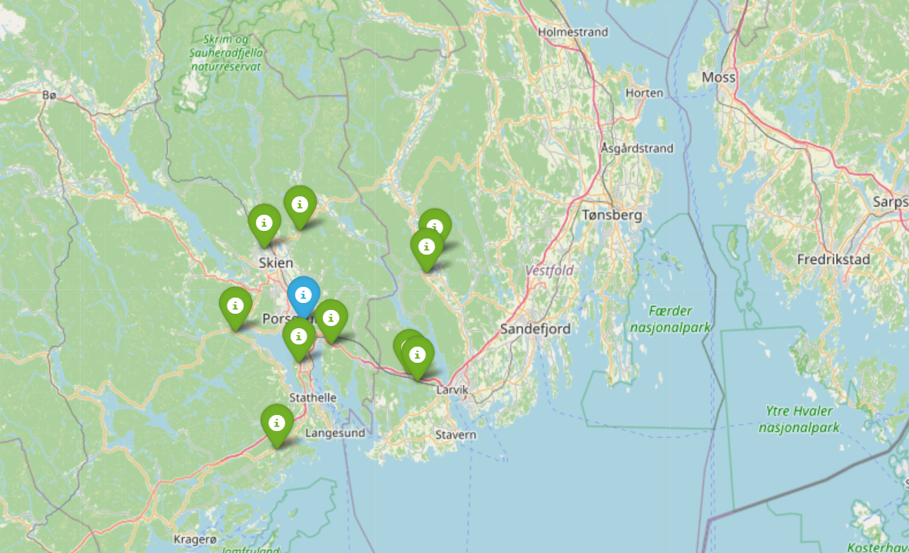

# 🌦️ Short Term Weather Map

Interactive visualization of short-term weather data from monitoring stations.

---

## 🌍 Live Interactive Map

Explore the weather map by clicking the image below:

---

## 📊 Features

- Interactive geographic map
- Weather station visualization
- Clean and simple interface
- Fully hosted via GitHub Pages

---

## 🚀 How to Use

1. Click the map above  
2. Zoom and pan to explore different areas  
3. Click markers for station data  

---

## 🛠️ Built With

- Python (pandas, folium)
- GitHub Pages (hosting)
- HTML/CSS

---

## 📁 Project Structure

## 🔗 Direct Link

👉 https://nilsjakob.github.io/short_term_weather/station_map.html